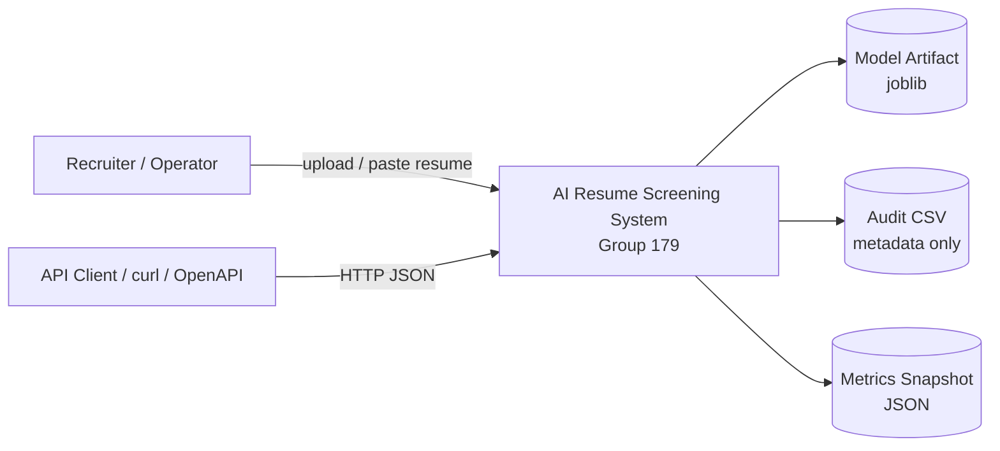
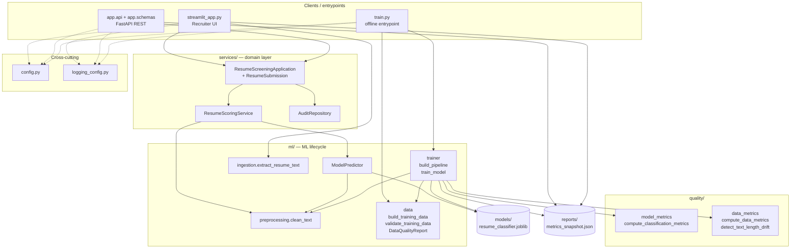
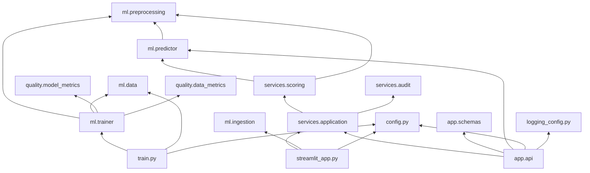
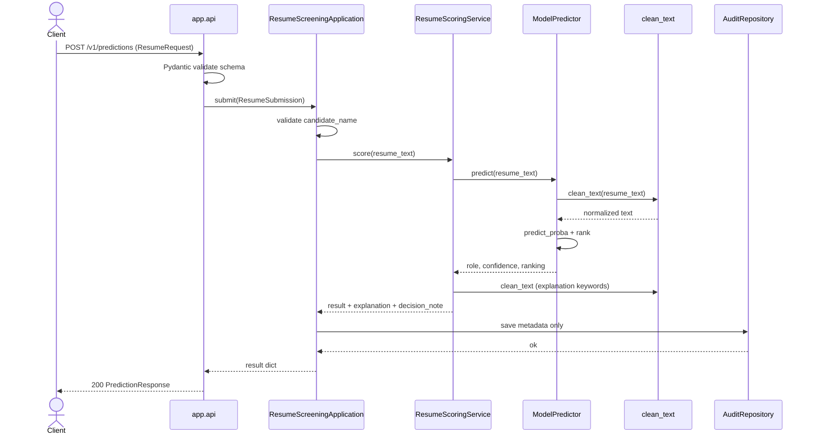
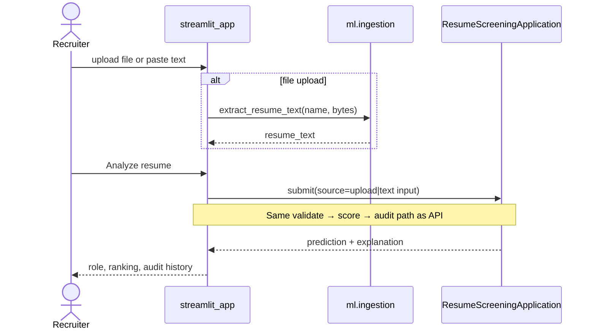
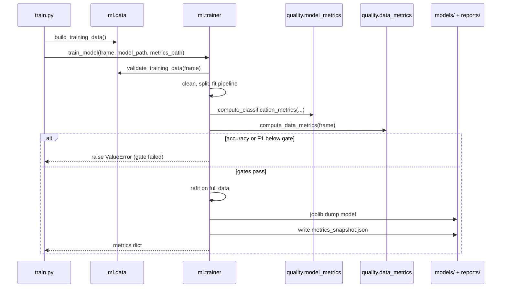
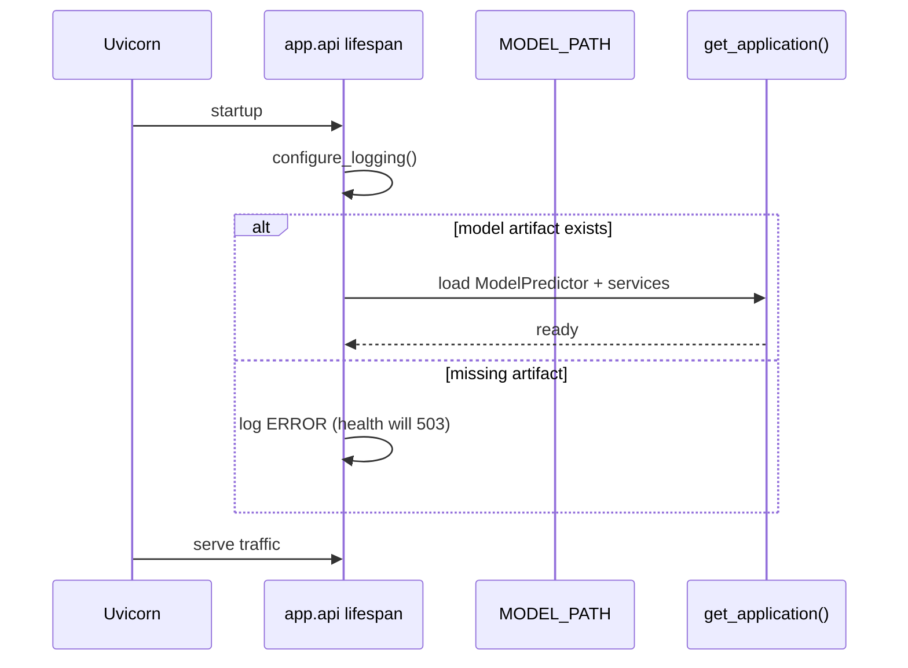
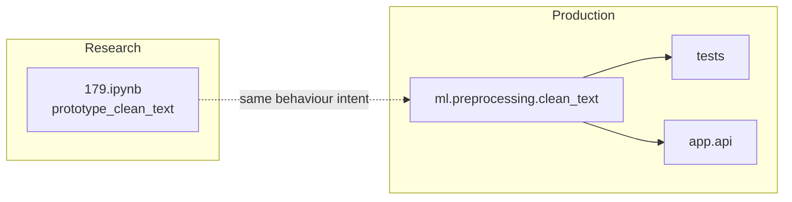

# Architecture Specification

**System:** AI Resume Screening System  
**Course:** AIMLCZG546 — Software Engineering for Machine Learning  
**Assignment:** II  
**Group:** 179  
**API version:** `2.1.0`  
**Document type:** System architecture, API contract, and runtime behaviour

---

## 1. Purpose and scope

This document describes the production architecture of the Assignment II system:
modular Python packages, REST API contracts, quality gates, and runtime flows.

| Concern | Where it lives | Role |
|---------|----------------|------|
| Production runtime | `ml/`, `services/`, `app/`, `quality/` | Deployable system |
| Course notebook | `179.ipynb` | Research vs production demo (assignment naming) |
| Executed notebook evidence | `notebooks/179_executed.ipynb` | Saved cell outputs |
| Written report | `report/179.pdf`, `report/179.docx` | Taxila narrative deliverable |
| Automated QA | `tests/`, `reports/` | Verification evidence |

The notebook is **not** the production runtime. Training, inference, API, and UI
are pure Python modules.

---

## 2. Folder structure

```text
submission/
├── architecture.md          # This document
├── README.md                # Setup, runbook, submission map
├── .gitignore
├── requirements.txt
├── pyproject.toml           # Black / isort / pytest config
├── .flake8
│
├── config.py                # Paths, model version, role labels
├── logging_config.py        # Rotating file + console logging
├── train.py                 # Offline training entrypoint
├── run_api.py               # FastAPI / uvicorn entrypoint
├── streamlit_app.py         # Recruiter UI (Assignment I continuity)
│
├── app/                     # HTTP transport layer
│   ├── api.py               # Routes, status codes, lifecycle
│   └── schemas.py           # Request / response contracts (Pydantic)
│
├── ml/                      # ML lifecycle components
│   ├── data.py              # Dataset build + schema validation
│   ├── ingestion.py         # TXT / PDF / DOCX extraction
│   ├── preprocessing.py     # Text normalization + input guards
│   ├── trainer.py           # Train, quality gates, artifact persist
│   └── predictor.py         # Load artifact + inference
│
├── services/                # Application / domain services
│   ├── application.py       # Orchestrate validate → score → audit
│   ├── scoring.py           # Explanation + human-oversight note
│   └── audit.py             # Privacy-preserving metadata store
│
├── quality/                 # Measurable quality metrics
│   ├── model_metrics.py     # Accuracy, F1, Brier, top-3
│   └── data_metrics.py      # Schema, missingness, balance, drift
│
├── tests/                   # pytest suite (unit, ML, API, data)
├── models/                  # Versioned model artifact (.joblib)
├── reports/                 # Lint, pytest, metrics snapshot evidence
│
├── 179.ipynb                # Required assignment notebook name
├── notebooks/
│   └── 179_executed.ipynb   # Notebook with verified outputs
│
└── report/
    ├── 179.pdf              # Submission report (PDF)
    └── 179.docx             # Submission report (Word)
```

### Structure principles

1. **One concern per package** — transport (`app`), ML (`ml`), domain (`services`), metrics (`quality`).
2. **Shared application service** — API and Streamlit cannot diverge on scoring/audit rules.
3. **Evidence separated from code** — `reports/`, `report/`, `notebooks/`.
4. **Git-friendly** — no venv, caches, or local logs checked in (see `.gitignore`).

---

## 3. Logical architecture

### 3.1 Context (C4 L1)



### 3.2 Component diagram (aligned with code structure)

Evaluator-facing view of **packages, classes, and key functions** for Assignment II
Objective 1. Edges match runtime/import dependencies verified against the
`submission/` codebase (solid = primary control/data flow; dotted = config/logging).

Source: [`docs/component_diagram.mmd`](docs/component_diagram.mmd)  
Rendered asset: [`docs/component_diagram.png`](docs/component_diagram.png)  
(Embedded in the Word report under §2 Refactoring as Figure 1b.)



| Component (class / module) | Responsibility |
|----------------------------|----------------|
| `streamlit_app` / `app.api` | Entrypoints; wire services; call `ResumeScreeningApplication` |
| `train.py` | Offline entry: `build_training_data` → `train_model` |
| `ResumeScreeningApplication` | Orchestrate validate → score → audit for API and UI |
| `ResumeScoringService` | Prediction + keyword explanation (`clean_text`) + advisory note |
| `AuditRepository` | Persist metadata only (no raw resume text) |
| `ModelPredictor` | Load joblib artifact; ranked class probabilities |
| `clean_text` (`ml.preprocessing`) | Typed normalization and input guards |
| `extract_resume_text` (`ml.ingestion`) | TXT/PDF/DOCX extraction and size/type checks |
| `ml.data` | Dataset build, schema validation, `DataQualityReport` |
| `train_model` (`ml.trainer`) | Fit pipeline, quality gates, persist artifact/metrics |
| `quality.*` | Model and data metrics (incl. text-length drift helper) |
| `config` / `logging_config` | Paths, version, rotating logs |
| `app.schemas` | REST request/response contracts |

### 3.3 Module dependency diagram



---

## 4. Component specifications

### 4.1 `ml` — machine learning lifecycle

| Module | Responsibility | Key contracts |
|--------|----------------|---------------|
| `data.py` | Build labelled demo set; validate schema/missing/classes | Raises on invalid training frames |
| `ingestion.py` | Extract text from TXT/PDF/DOCX | Max 5 MB; supported suffixes only |
| `preprocessing.py` | Normalize resume text | Type/empty/size/semantic checks; max 20 000 chars |
| `trainer.py` | Fit TF-IDF + LogisticRegression; gates; persist | Min accuracy/F1 ≥ 0.80 |
| `predictor.py` | Load artifact; rank role probabilities | Returns role, confidence, full ranking |

### 4.2 `services` — domain orchestration

| Module | Responsibility |
|--------|----------------|
| `scoring.py` | Model prediction + keyword explanation + advisory decision note |
| `audit.py` | Persist metadata only (never raw resume body) |
| `application.py` | Single submission pipeline for API and UI |

### 4.3 `app` — transport

| Module | Responsibility |
|--------|----------------|
| `schemas.py` | Pydantic request/response models |
| `api.py` | HTTP routes, status codes, lifespan model load |

### 4.4 `quality` — measurable QA

| Module | Metrics |
|--------|---------|
| `model_metrics.py` | Accuracy, weighted F1, multiclass Brier, top-3 accuracy |
| `data_metrics.py` | Schema flag, missing rate, duplicates, class balance, text-length drift |

---

## 5. API definition

**Base URL (local):** `http://127.0.0.1:8000`  
**Interactive docs:** `GET /docs` (OpenAPI / Swagger UI)  
**Framework:** FastAPI + Pydantic v2  
**Content-Type:** `application/json`

### 5.1 Endpoint catalogue

| Method | Path | Purpose | Success | Error codes |
|--------|------|---------|---------|-------------|
| `GET` | `/health` | Readiness: artifact present, API version | `200` | `503` model missing |
| `POST` | `/predict` | Inference (compatibility alias) | `200` | `422`, `503`, `500` |
| `POST` | `/v1/predictions` | Versioned inference | `200` | `422`, `503`, `500` |
| `GET` | `/metrics` | Last training metrics snapshot | `200` | `404` snapshot missing |
| `GET` | `/docs` | OpenAPI UI | `200` | — |

`/predict` and `/v1/predictions` share the same handler and application service.

### 5.2 `GET /health`

**Response `200` — `HealthResponse`**

```json
{
  "status": "healthy",
  "model_loaded": true,
  "version": "2.1.0"
}
```

**Response `503`**

```json
{
  "detail": "Model artifact is unavailable"
}
```

### 5.3 `POST /v1/predictions` (and `POST /predict`)

**Request — `ResumeRequest`**

| Field | Type | Constraints |
|-------|------|-------------|
| `candidate_name` | string | 1–100 chars after strip; not blank |
| `resume_text` | string | 20–20 000 chars; must yield usable text after normalization |

```json
{
  "candidate_name": "Demo Candidate",
  "resume_text": "Experienced QA engineer with selenium playwright automation testing and regression skills."
}
```

**Response `200` — `PredictionResponse`**

| Field | Type | Description |
|-------|------|-------------|
| `candidate_name` | string | Echo of validated name |
| `predicted_role` | string | Top predicted job role |
| `confidence` | float | `[0.0, 1.0]` top-class probability |
| `role_ranking` | array | All classes sorted by probability descending |
| `role_ranking[].role` | string | Class label |
| `role_ranking[].probability` | float | `[0.0, 1.0]` |
| `explanation` | string | Keyword evidence or limited-evidence message |
| `decision_note` | string | Human-oversight advisory text |

```json
{
  "candidate_name": "Demo Candidate",
  "predicted_role": "QA Engineer",
  "confidence": 0.42,
  "role_ranking": [
    { "role": "QA Engineer", "probability": 0.42 },
    { "role": "Backend Developer", "probability": 0.15 }
  ],
  "explanation": "Matched evidence: testing, selenium, playwright, automation",
  "decision_note": "Advisory output only; no automatic rejection is performed."
}
```

**Error semantics**

| Code | When |
|------|------|
| `422` | Schema violation or domain rejection (blank name, empty after clean, too short, etc.) |
| `503` | Model artifact missing / unloadable |
| `500` | Unexpected server failure |

### 5.4 `GET /metrics`

**Response `200` — `MetricsSnapshot`**

```json
{
  "generated_at_utc": "2026-08-01T09:09:38+00:00",
  "model_path": "resume_classifier.joblib",
  "model_quality": {
    "accuracy": 1.0,
    "weighted_f1": 1.0,
    "multiclass_brier": 0.725,
    "top_3_accuracy": 1.0,
    "validation_rows": 12
  },
  "data_quality": {
    "schema_valid": true,
    "missing_value_rate": 0.0,
    "duplicate_rows": 0,
    "class_count": 6,
    "minority_class_fraction": 0.167,
    "text_length_mean": 76.96,
    "text_length_std": 8.12
  },
  "quality_gates": {
    "minimum_accuracy": 0.8,
    "minimum_weighted_f1": 0.8,
    "passed": true
  }
}
```

**Response `404`:** metrics snapshot file not present (run `python train.py`).

### 5.5 Example client calls

```bash
curl http://127.0.0.1:8000/health

curl http://127.0.0.1:8000/metrics

curl -X POST http://127.0.0.1:8000/v1/predictions \
  -H "Content-Type: application/json" \
  -d "{\"candidate_name\":\"Demo\",\"resume_text\":\"Python machine learning statistics NLP and model evaluation experience.\"}"
```

---

## 6. Sequence diagrams

### 6.1 Online inference (API)



### 6.2 Online inference (Streamlit — shared domain path)



### 6.3 Offline training and release gates



### 6.4 API startup readiness



---

## 7. Data and quality specification

### 7.1 Training schema

| Column | Type | Rules |
|--------|------|-------|
| `resume_text` | string | Required; non-null; used after `clean_text` |
| `job_role` | string | Required; ≥2 classes; ≥2 rows per class |

**Role labels (v2.1.0):** Backend Developer, Data Engineer, Data Scientist, DevOps Engineer, Frontend Developer, QA Engineer.

### 7.2 Quality gates

| Gate | Threshold | Enforcement |
|------|-----------|-------------|
| Accuracy | ≥ 0.80 | Hard fail in `train_model` |
| Weighted F1 | ≥ 0.80 | Hard fail in `train_model` |
| Schema / missing required values | valid / 0 | Hard fail in `validate_training_data` |
| Top-3 accuracy, Brier, drift | monitored | Reported; not hard-gated |

### 7.3 Privacy / security constraints (implemented)

- Raw resume text is **not** written to audit CSV.
- Logs record lengths and outcomes, not full resume bodies.
- Input validation: type, length, semantic content, file type, 5 MB upload cap.
- Outputs are **advisory** (`decision_note`); no automated rejection.

---

## 8. Cross-cutting concerns

| Concern | Implementation |
|---------|----------------|
| Configuration | `config.py` — model path, metrics path, audit path, version |
| Logging | `logging_config.py` — INFO default; rotating 1 MB × 3 backups under `logs/` (runtime, gitignored) |
| Formatting | Black + isort (line length 88) |
| Linting | Flake8 |
| Testing | pytest under `tests/` |
| Model persistence | `joblib` → `models/resume_classifier.joblib` |
| Metrics persistence | JSON → `reports/metrics_snapshot.json` |

---

## 9. Research vs production boundary



| Aspect | Research (`179.ipynb`) | Production (`ml/…`) |
|--------|------------------------|---------------------|
| Purpose | Feasibility / teaching | Repeatable service behaviour |
| Structure | Inline cell | Importable module |
| Validation | Minimal | Type, empty, size, semantic |
| Observability | Notebook display | Structured logs |
| Quality | Manual | Unit + API tests |

---

## 10. Runtime deployment topology (local)

| Process | Command | Port / UI |
|---------|---------|-----------|
| Train | `python train.py` | Writes `models/`, `reports/` |
| API | `python run_api.py` | `http://127.0.0.1:8000` |
| OpenAPI | browser | `http://127.0.0.1:8000/docs` |
| Recruiter UI | `streamlit run streamlit_app.py` | Streamlit default port |
| Tests | `pytest -q` | Console report |

---

## 11. Assignment II objective mapping

| # | Objective | Architecture locus |
|---|-----------|-------------------|
| 1 | Modular refactor | `ml/`, `services/`, `app/`, `quality/` |
| 2 | Research vs production | `179.ipynb` vs `ml/preprocessing.py` |
| 3 | Logging / errors | `logging_config.py` + critical modules |
| 4 | Format / lint | `reports/lint_*.txt`, tool configs |
| 5 | REST API | `app/api.py`, `app/schemas.py` |
| 6–7 | Tests | `tests/` |
| 8 | Model + data metrics | `quality/`, `reports/metrics_snapshot.json` |
| 9 | Prod experiment + security | Documented in `report/`; controls in validation/audit |

---

## 12. Document control

| Field | Value |
|-------|-------|
| System version | 2.1.0 |
| Group | 179 |
| Primary readers | Course evaluators, group members, future maintainers |
| Companion docs | `README.md`, `report/179.pdf` |
